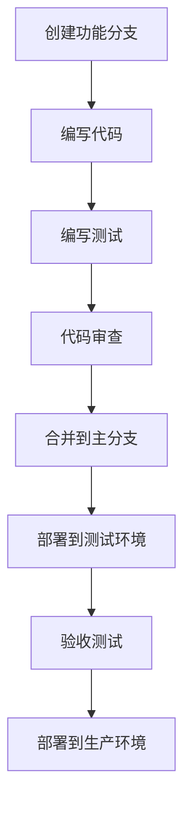

# AgentTeam Dashboard - 开发指南

## 🚀 开发环境搭建

### 系统要求

- **Node.js**: v18.0.0 或更高版本
- **pnpm**: v8.0.0 或更高版本
- **Git**: v2.30.0 或更高版本

### 环境配置步骤

1. **克隆代码仓库**

```bash
git clone https://github.com/your-org/agentteam-dashboard.git
cd agentteam-dashboard
```

2. **安装依赖**

```bash
# 使用pnpm（推荐）
pnpm install

# 或使用npm
npm install

# 或使用yarn
yarn install
```

3. **配置开发环境变量**

创建 `.env.development` 文件：

```env
# API基础URL
VITE_API_BASE_URL=http://localhost:3000

# WebSocket URL（用于实时更新）
VITE_WS_URL=ws://localhost:3000

# 启用开发模式
VITE_MODE=development

# 模拟数据开关
VITE_USE_MOCK_DATA=true

# 日志级别
VITE_LOG_LEVEL=debug
```

4. **启动开发服务器**

```bash
# 使用pnpm
pnpm dev

# 或使用npm
npm run dev

# 或使用yarn
yarn dev
```

5. **访问开发环境**

打开浏览器访问：http://localhost:5173

---

## 📁 项目结构详解

### 核心目录结构

```
src/
├── components/          # React组件
│   ├── ui/             # 通用UI组件
│   ├── layout/         # 布局组件
│   ├── agents/         # 智能体相关组件
│   └── tasks/          # 任务相关组件
├── stores/             # Zustand状态管理
├── pages/              # 页面组件
├── types/              # TypeScript类型定义
├── lib/                # 工具函数和配置
├── hooks/              # 自定义React Hooks
├── utils/              # 通用工具函数
└── constants/          # 常量定义
```

### 文件命名规范

#### 组件文件
- **文件名**: PascalCase (e.g., `AgentCard.tsx`)
- **组件名**: 与文件名一致
- **样式文件**: 与组件同名 (e.g., `AgentCard.module.css`)

#### 工具文件
- **文件名**: camelCase (e.g., `apiClient.ts`)
- **Hook文件**: 以`use`开头 (e.g., `useAgentStatus.ts`)

#### 类型定义文件
- **文件名**: 按功能命名 (e.g., `agent.types.ts`)
- **接口名**: PascalCase，以`I`或`Interface`结尾 (e.g., `IAgent`)

---

## 🛠️ 开发工作流

### 1. 功能开发流程



#### 分支管理

```bash
# 创建功能分支
git checkout -b feature/agent-card-enhancement

# 提交更改
git add .
git commit -m "feat(agent-card): add status indicator and click handler"

# 推送到远程
git push origin feature/agent-card-enhancement

# 创建Pull Request
```

### 2. 代码提交规范

#### 提交消息格式

```
<type>(<scope>): <subject>

<body>

<footer>
```

#### Type类型

- **feat**: 新功能
- **fix**: 错误修复
- **docs**: 文档更新
- **style**: 代码格式化
- **refactor**: 代码重构
- **test**: 添加测试
- **chore**: 构建过程或辅助工具的变动

#### 示例

```
feat(agent-card): add online status indicator

- 添加了智能体在线状态指示器
- 支持自定义状态颜色
- 优化了卡片点击事件

Closes #123
```

---

## 🎯 组件开发规范

### 1. 组件设计原则

#### 单一职责原则
每个组件应该只负责一项主要功能：

```typescript
// ✅ 推荐：单一职责
const AgentCard = () => {
  // 只负责展示智能体信息
}

const AgentStatus = () => {
  // 只负责显示状态
}

// ❌ 不推荐：职责混合
const AgentCardWithStatus = () => {
  // 同时处理智能体信息和状态
}
```

#### 可组合性
组件应该支持组合使用：

```typescript
// ✅ 推荐：可组合
<Card>
  <CardHeader>
    <CardTitle>智能体管理</CardTitle>
  </CardHeader>
  <CardContent>
    <AgentList agents={agents} />
  </CardContent>
</Card>

// ❌ 不推荐：硬编码
<AgentManagementCard agents={agents} />
```

### 2. 组件实现规范

#### Props接口定义

```typescript
// ✅ 推荐：完整的接口定义
interface AgentCardProps {
  /** 智能体ID */
  id: string
  
  /** 智能体名称 */
  name: string
  
  /** 智能体状态 */
  status: AgentStatus
  
  /** 当前任务（可选） */
  currentTask?: string
  
  /** 点击事件处理函数 */
  onClick?: (id: string) => void
  
  /** 额外类名 */
  className?: string
  
  /** 测试ID */
  'data-testid'?: string
}

// ❌ 不推荐：缺少文档
interface AgentCardProps {
  id: string
  name: string
  status: AgentStatus
  currentTask?: string
  onClick?: (id: string) => void
  className?: string
}
```

#### 默认Props

```typescript
// ✅ 推荐：使用defaultProps
const defaultProps: Partial<AgentCardProps> = {
  status: 'idle',
  onClick: () => {},
  className: ''
}

AgentCard.defaultProps = defaultProps

// 或使用ES6默认参数
const AgentCard = ({
  status = 'idle',
  onClick = () => {},
  className = ''
}: AgentCardProps) => {
  // 组件实现
}
```

#### 组件状态管理

```typescript
// ✅ 推荐：局部状态
const AgentCard = ({ agent }: AgentCardProps) => {
  const [isHovered, setIsHovered] = useState(false)
  const [isLoading, setIsLoading] = useState(false)
  
  // 副作用处理
  useEffect(() => {
    if (agent.status === 'running') {
      setIsLoading(true)
    }
  }, [agent.status])
  
  return (
    <div 
      onMouseEnter={() => setIsHovered(true)}
      onMouseLeave={() => setIsHovered(false)}
    >
      {/* 组件内容 */}
    </div>
  )
}
```

---

## 🔧 状态管理最佳实践

### 1. Zustand Store设计

#### Store拆分

```typescript
// ❌ 不推荐：单一大型store
interface AppStore {
  agents: Agent[]
  tasks: Task[]
  activities: Activity[]
  metrics: DoraMetrics
  // ... 更多状态
}

// ✅ 推荐：按业务拆分
// stores/agentStore.ts
interface AgentStore {
  agents: Agent[]
  activities: Activity[]
  metrics: DoraMetrics
  updateAgent: (id: string, updates: Partial<Agent>) => void
  addActivity: (activity: Activity) => void
}

// stores/taskStore.ts
interface TaskStore {
  tasks: Task[]
  selectedTaskId: string | null
  filter: TaskFilter
  setFilter: (filter: TaskFilter) => void
  selectTask: (id: string | null) => void
}
```

#### Store选择器优化

```typescript
// ✅ 推荐：使用选择器
const useAgentStore = create<AgentStore>((set, get) => ({
  agents: [],
  activities: [],
  metrics: initialMetrics,
  
  // 选择器：获取运行中的智能体
  runningAgents: () => get().agents.filter(a => a.status === 'running'),
  
  // 选择器：获取今日活跃的智能体
  activeToday: () => get().agents.filter(a => 
    new Date(a.lastActiveAt).toDateString() === new Date().toDateString()
  )
}))

// 组件中使用
const runningAgents = useAgentStore(state => state.runningAgents())
const activeCount = useAgentStore(state => state.activeToday().length)
```

### 2. 异步操作处理

```typescript
// stores/agentStore.ts
interface AgentStore {
  // ... 其他状态
  
  // 异步操作：加载智能体列表
  loadAgents: () => Promise<void>
  
  // 异步操作：更新智能体状态
  updateAgentStatus: (id: string, status: AgentStatus) => Promise<void>
}

export const useAgentStore = create<AgentStore>((set, get) => ({
  // ... 其他状态
  
  loadAgents: async () => {
    set({ loading: true, error: null })
    try {
      const response = await fetch('/api/agents')
      const agents = await response.json()
      set({ agents, loading: false })
    } catch (error) {
      set({ error: error.message, loading: false })
    }
  },
  
  updateAgentStatus: async (id, status) => {
    try {
      await fetch(`/api/agents/${id}/status`, {
        method: 'PUT',
        body: JSON.stringify({ status })
      })
      
      set(state => ({
        agents: state.agents.map(agent => 
          agent.id === id ? { ...agent, status } : agent
        )
      }))
    } catch (error) {
      console.error('更新智能体状态失败:', error)
      throw error
    }
  }
}))
```

---

## 🎨 样式开发规范

### 1. Tailwind CSS使用规范

#### 类名组织

```typescript
// ✅ 推荐：逻辑分组
<div className="
  // 布局
  flex items-center justify-between
  
  // 间距
  p-4 m-2
  
  // 颜色
  bg-white dark:bg-gray-800
  
  // 边框
  border border-gray-200 rounded-lg
  
  // 交互
  hover:shadow-md transition-shadow duration-200
  
  // 响应式
  sm:flex-col md:flex-row
">
  {/* 内容 */}
</div>

// ❌ 不推荐：无序排列
<div className="bg-white p-4 rounded-lg m-2 border border-gray-200 hover:shadow-md sm:flex-col flex items-center justify-between md:flex-row transition-shadow duration-200 dark:bg-gray-800">
  {/* 内容 */}
</div>
```

#### 响应式设计

```typescript
// ✅ 推荐：移动优先
<div className="
  // 移动端（默认）
  flex flex-col space-y-2 p-2
  
  // 平板
  sm:flex-row sm:space-y-0 sm:space-x-2 p-4
  
  // 桌面
  md:space-x-4 lg:p-6
">
  {/* 内容 */}
</div>
```

### 2. CSS Modules使用

```typescript
// AgentCard.module.css
.card {
  @apply flex items-center p-4 bg-white rounded-lg shadow-sm hover:shadow-md transition-shadow;
}

.avatar {
  @apply w-12 h-12 rounded-full flex items-center justify-center text-white font-semibold;
}

.status {
  @apply flex items-center space-x-2;
}

.statusIndicator {
  @apply w-2 h-2 rounded-full;
}

.running {
  @apply bg-green-500;
}

.idle {
  @apply bg-gray-400;
}

.error {
  @apply bg-red-500;
}

// AgentCard.tsx
import styles from './AgentCard.module.css'

const AgentCard = ({ agent }: AgentCardProps) => {
  return (
    <div className={styles.card}>
      <div className={`${styles.avatar} ${agent.avatarColor}`}>
        {agent.initials}
      </div>
      <div className={styles.status}>
        <span className={`${styles.statusIndicator} ${styles[agent.status]}`} />
        <span>{agent.status}</span>
      </div>
    </div>
  )
}
```

---

## 📡 API集成

### 1. API客户端配置

```typescript
// lib/apiClient.ts
import axios, { AxiosInstance, AxiosError } from 'axios'

class ApiClient {
  private client: AxiosInstance
  
  constructor() {
    this.client = axios.create({
      baseURL: import.meta.env.VITE_API_BASE_URL,
      timeout: 10000,
      headers: {
        'Content-Type': 'application/json'
      }
    })
    
    this.setupInterceptors()
  }
  
  private setupInterceptors() {
    // 请求拦截器
    this.client.interceptors.request.use(
      (config) => {
        const token = localStorage.getItem('auth_token')
        if (token) {
          config.headers.Authorization = `Bearer ${token}`
        }
        return config
      },
      (error) => Promise.reject(error)
    )
    
    // 响应拦截器
    this.client.interceptors.response.use(
      (response) => response.data,
      (error: AxiosError) => {
        if (error.response?.status === 401) {
          // 处理未授权
          window.location.href = '/login'
        }
        return Promise.reject(error)
      }
    )
  }
  
  // GET请求
  async get<T>(url: string, params?: Record<string, any>): Promise<T> {
    return this.client.get(url, { params })
  }
  
  // POST请求
  async post<T>(url: string, data?: any): Promise<T> {
    return this.client.post(url, data)
  }
  
  // PUT请求
  async put<T>(url: string, data?: any): Promise<T> {
    return this.client.put(url, data)
  }
  
  // DELETE请求
  async delete<T>(url: string): Promise<T> {
    return this.client.delete(url)
  }
}

export const apiClient = new ApiClient()
```

### 2. API Hook封装

```typescript
// hooks/useAgents.ts
import { useState, useEffect } from 'react'
import { apiClient } from '@/lib/apiClient'
import type { Agent } from '@/types'

export const useAgents = () => {
  const [agents, setAgents] = useState<Agent[]>([])
  const [loading, setLoading] = useState(true)
  const [error, setError] = useState<string | null>(null)
  
  const loadAgents = async () => {
    try {
      setLoading(true)
      const data = await apiClient.get<Agent[]>('/agents')
      setAgents(data)
    } catch (err) {
      setError(err instanceof Error ? err.message : '加载失败')
    } finally {
      setLoading(false)
    }
  }
  
  useEffect(() => {
    loadAgents()
  }, [])
  
  return {
    agents,
    loading,
    error,
    refetch: loadAgents
  }
}

// 组件中使用
const AgentList = () => {
  const { agents, loading, error } = useAgents()
  
  if (loading) return <LoadingSpinner />
  if (error) return <ErrorMessage message={error} />
  
  return (
    <div>
      {agents.map(agent => (
        <AgentCard key={agent.id} agent={agent} />
      ))}
    </div>
  )
}
```

---

## 🧪 测试策略

### 1. 单元测试

#### 组件测试

```typescript
// components/__tests__/AgentCard.test.tsx
import { render, screen, fireEvent } from '@testing-library/react'
import { AgentCard } from '../AgentCard'

describe('AgentCard', () => {
  const mockAgent = {
    id: 'main',
    name: '主智能体',
    status: 'running' as const,
    currentTask: 'task-001',
    todayCompleted: 5,
    todayProcessedMin: 120,
    lastActiveAt: '2026-03-22T14:30:00Z'
  }
  
  it('正确渲染智能体信息', () => {
    render(<AgentCard agent={mockAgent} />)
    
    expect(screen.getByText('主智能体')).toBeInTheDocument()
    expect(screen.getByText('运行中')).toBeInTheDocument()
    expect(screen.getByText('5个')).toBeInTheDocument()
    expect(screen.getByText('120分钟')).toBeInTheDocument()
  })
  
  it('点击时调用onClick处理函数', () => {
    const handleClick = jest.fn()
    render(<AgentCard agent={mockAgent} onClick={handleClick} />)
    
    fireEvent.click(screen.getByText('主智能体'))
    expect(handleClick).toHaveBeenCalledWith('main')
  })
  
  it('根据状态显示正确的颜色', () => {
    const { rerender } = render(<AgentCard agent={mockAgent} />)
    
    // 运行中状态
    expect(screen.getByTestId('status-indicator')).toHaveClass('bg-green-500')
    
    // 切换到空闲状态
    rerender(<AgentCard agent={{ ...mockAgent, status: 'idle' }} />)
    expect(screen.getByTestId('status-indicator')).toHaveClass('bg-gray-400')
  })
})
```

#### Store测试

```typescript
// stores/__tests__/agentStore.test.ts
import { useAgentStore } from '../agentStore'

describe('AgentStore', () => {
  beforeEach(() => {
    // 重置store状态
    useAgentStore.setState({
      agents: [],
      activities: [],
      metrics: initialMetrics,
      loading: false,
      error: null
    })
  })
  
  it('正确更新智能体状态', () => {
    const { updateAgentStatus } = useAgentStore.getState()
    
    // 初始状态
    expect(useAgentStore.getState().agents).toEqual([])
    
    // 添加智能体
    useAgentStore.setState({
      agents: [
        { id: 'main', status: 'idle', /* ...其他属性 */ }
      ]
    })
    
    // 更新状态
    updateAgentStatus('main', 'running')
    
    // 验证更新
    const agents = useAgentStore.getState().agents
    expect(agents[0].status).toBe('running')
  })
  
  it('正确处理异步加载', async () => {
    const { loadAgents } = useAgentStore.getState()
    
    // 设置loading状态
    useAgentStore.setState({ loading: true })
    
    await loadAgents()
    
    const state = useAgentStore.getState()
    expect(state.loading).toBe(false)
    expect(state.agents.length).toBeGreaterThan(0)
  })
})
```

### 2. 集成测试

```typescript
// __tests__/AgentList.integration.test.tsx
import { render, screen, waitFor } from '@testing-library/react'
import { Provider } from 'zustand/react'
import { useAgentStore } from '@/stores/agentStore'
import { AgentList } from '@/components/agents/AgentList'

// 模拟API响应
jest.mock('@/lib/apiClient', () => ({
  apiClient: {
    get: jest.fn().mockResolvedValue([
      { id: 'main', name: '主智能体', status: 'running' },
      { id: 'code', name: '代码智能体', status: 'idle' }
    ])
  }
}))

describe('AgentList Integration', () => {
  it('完整加载和渲染智能体列表', async () => {
    render(
      <Provider store={useAgentStore}>
        <AgentList />
      </Provider>
    )
    
    // 初始加载状态
    expect(screen.getByText('加载中...')).toBeInTheDocument()
    
    // 等待数据加载完成
    await waitFor(() => {
      expect(screen.getByText('主智能体')).toBeInTheDocument()
      expect(screen.getByText('代码智能体')).toBeInTheDocument()
    })
    
    // 验证状态显示
    expect(screen.getByText('运行中')).toBeInTheDocument()
    expect(screen.getByText('空闲')).toBeInTheDocument()
  })
})
```

---

## 📦 构建和部署

### 1. 生产环境构建

```bash
# 安装依赖（生产环境）
pnpm install --prod

# 构建应用
pnpm build

# 预览构建结果
pnpm preview
```

### 2. 环境变量配置

#### 生产环境 `.env.production`

```env
# 生产环境API地址
VITE_API_BASE_URL=https://api.agentteam.com

# WebSocket地址
VITE_WS_URL=wss://api.agentteam.com

# 禁用模拟数据
VITE_USE_MOCK_DATA=false

# 日志级别
VITE_LOG_LEVEL=warn

# 分析工具
VITE_ENABLE_ANALYTICS=true
VITE_ANALYTICS_ID=your-analytics-id
```

#### 测试环境 `.env.staging`

```env
# 测试环境API地址
VITE_API_BASE_URL=https://api.staging.agentteam.com

# 启用部分模拟数据
VITE_USE_MOCK_DATA=true

# 日志级别
VITE_LOG_LEVEL=info
```

### 3. Docker部署

```dockerfile
# Dockerfile
FROM node:18-alpine as builder

WORKDIR /app

# 安装依赖
COPY package.json pnpm-lock.yaml ./
RUN npm install -g pnpm && pnpm install --prod

# 复制源代码
COPY . .

# 构建应用
RUN pnpm build

# 生产环境镜像
FROM nginx:alpine as production

# 复制构建产物
COPY --from=builder /app/dist /usr/share/nginx/html

# 复制Nginx配置
COPY nginx.conf /etc/nginx/conf.d/default.conf

# 暴露端口
EXPOSE 80

# 启动Nginx
CMD ["nginx", "-g", "daemon off;"]
```

#### Nginx配置

```nginx
# nginx.conf
server {
    listen 80;
    server_name localhost;
    root /usr/share/nginx/html;
    index index.html;

    # 静态文件缓存
    location ~* \.(js|css|png|jpg|jpeg|gif|ico|svg)$ {
        expires 1y;
        add_header Cache-Control "public, immutable";
    }

    # 前端路由支持
    location / {
        try_files $uri $uri/ /index.html;
    }

    # API代理（如果需要）
    location /api/ {
        proxy_pass http://backend:3000;
        proxy_set_header Host $host;
        proxy_set_header X-Real-IP $remote_addr;
    }
}
```

### 4. CI/CD配置

#### GitHub Actions

```yaml
# .github/workflows/deploy.yml
name: Deploy AgentTeam Dashboard

on:
  push:
    branches: [ main ]
  pull_request:
    branches: [ main ]

jobs:
  build-and-deploy:
    runs-on: ubuntu-latest
    
    steps:
    - name: Checkout code
      uses: actions/checkout@v3
    
    - name: Setup Node.js
      uses: actions/setup-node@v3
      with:
        node-version: '18'
        cache: 'pnpm'
    
    - name: Install dependencies
      run: pnpm install
    
    - name: Run tests
      run: pnpm test
    
    - name: Build application
      run: pnpm build
    
    - name: Deploy to production
      uses: appleboy/ssh-action@master
      with:
        host: ${{ secrets.SSH_HOST }}
        username: ${{ secrets.SSH_USERNAME }}
        key: ${{ secrets.SSH_KEY }}
        script: |
          cd /var/www/agentteam-dashboard
          git pull origin main
          pnpm install --prod
          pnpm build
          docker-compose up -d
```

---

## 🔍 性能优化

### 1. 组件性能优化

#### React.memo优化

```typescript
import React, { memo, useMemo } from 'react'

// ✅ 推荐：使用React.memo优化函数组件
const AgentCard = memo(({ agent, onClick }: AgentCardProps) => {
  // 使用useMemo优化计算
  const statusColor = useMemo(() => {
    const colors = {
      running: 'bg-green-500',
      idle: 'bg-gray-400',
      error: 'bg-red-500'
    }
    return colors[agent.status]
  }, [agent.status])
  
  return (
    <div 
      onClick={() => onClick(agent.id)}
      className={`agent-card ${statusColor}`}
    >
      {/* 组件内容 */}
    </div>
  )
})

AgentCard.displayName = 'AgentCard'
```

#### 虚拟滚动

```typescript
// components/common/VirtualList.tsx
import { FixedSizeList as List } from 'react-window'

interface VirtualListProps {
  items: any[]
  itemHeight: number
  height: number
  renderItem: (item: any) => React.ReactNode
}

export const VirtualList = ({ items, itemHeight, height, renderItem }: VirtualListProps) => {
  const Row = ({ index, style }: { index: number; style: React.CSSProperties }) => (
    <div style={style}>
      {renderItem(items[index])}
    </div>
  )
  
  return (
    <List
      height={height}
      itemCount={items.length}
      itemSize={itemHeight}
      width="100%"
    >
      {Row}
    </List>
  )
}

// 使用
const AgentList = ({ agents }: { agents: Agent[] }) => {
  return (
    <VirtualList
      items={agents}
      itemHeight={80}
      height={600}
      renderItem={(agent) => <AgentCard agent={agent} />}
    />
  )
}
```

### 2. 状态管理优化

#### 批量更新

```typescript
// ✅ 推荐：批量更新
const updateMultipleAgents = (updates: Array<{ id: string; status: AgentStatus }>) => {
  useAgentStore.setState(state => ({
    agents: state.agents.map(agent => {
      const update = updates.find(u => u.id === agent.id)
      return update ? { ...agent, status: update.status } : agent
    })
  }))
}

// ❌ 不推荐：多次单独更新
const updateMultipleAgents = (updates: Array<{ id: string; status: AgentStatus }>) => {
  updates.forEach(({ id, status }) => {
    useAgentStore.getState().updateAgentStatus(id, status)
  })
}
```

#### 状态持久化

```typescript
// stores/themeStore.ts
import { create } from 'zustand'
import { persist } from 'zustand/middleware'

interface ThemeStore {
  theme: 'light' | 'dark'
  toggleTheme: () => void
}

export const useThemeStore = create<ThemeStore>()(
  persist(
    (set) => ({
      theme: 'light',
      toggleTheme: () => set(state => ({ theme: state.theme === 'light' ? 'dark' : 'light' }))
    }),
    {
      name: 'agentteam-theme-storage',
      partialize: (state) => ({ theme: state.theme })
    }
  )
)
```

---

## 📊 监控和分析

### 1. 性能监控

#### Web Vitals

```typescript
// lib/analytics.ts
import { getCLS, getFID, getFCP, getLCP, getTTFB } from 'web-vitals'

const reportWebVitals = (metric: any) => {
  console.log(metric)
  
  // 发送到分析服务
  fetch('/api/analytics/vitals', {
    method: 'POST',
    body: JSON.stringify(metric),
    headers: { 'Content-Type': 'application/json' }
  })
}

// 监控核心Web指标
getCLS(reportWebVitals)
getFID(reportWebVitals)
getFCP(reportWebVitals)
getLCP(reportWebVitals)
getTTFB(reportWebVitals)
```

#### 自定义指标

```typescript
// lib/performance.ts
export const measureComponentPerformance = (componentName: string) => {
  const startTime = performance.now()
  
  return {
    end: () => {
      const endTime = performance.now()
      const duration = endTime - startTime
      
      console.log(`${componentName} 渲染耗时: ${duration.toFixed(2)}ms`)
      
      // 发送性能数据
      if (duration > 100) {
        // 警告慢渲染
        console.warn(`${componentName} 渲染较慢`)
      }
    }
  }
}

// 组件中使用
const MyComponent = () => {
  const { end } = measureComponentPerformance('MyComponent')
  
  useEffect(() => {
    end()
  }, [end])
  
  return <div>组件内容</div>
}
```

### 2. 错误监控

#### 全局错误处理

```typescript
// lib/errorHandler.ts
export const setupGlobalErrorHandling = () => {
  // 全局错误事件监听
  window.addEventListener('error', (event) => {
    console.error('全局错误:', event.error)
    
    // 发送到错误监控服务
    fetch('/api/error-tracking', {
      method: 'POST',
      body: JSON.stringify({
        message: event.error.message,
        stack: event.error.stack,
        url: window.location.href,
        userAgent: navigator.userAgent,
        timestamp: new Date().toISOString()
      }),
      headers: { 'Content-Type': 'application/json' }
    })
  })
  
  // Promise未处理拒绝
  window.addEventListener('unhandledrejection', (event) => {
    console.error('未处理的Promise拒绝:', event.reason)
  })
}
```

#### 组件错误边界

```typescript
// components/common/ErrorBoundary.tsx
import React, { Component, ErrorInfo } from 'react'

interface ErrorBoundaryProps {
  children: React.ReactNode
  fallback?: React.ReactNode
}

interface ErrorBoundaryState {
  hasError: boolean
  error: Error | null
}

export class ErrorBoundary extends Component<ErrorBoundaryProps, ErrorBoundaryState> {
  constructor(props: ErrorBoundaryProps) {
    super(props)
    this.state = { hasError: false, error: null }
  }
  
  static getDerivedStateFromError(error: Error): ErrorBoundaryState {
    return { hasError: true, error }
  }
  
  componentDidCatch(error: Error, errorInfo: ErrorInfo) {
    console.error('组件错误:', error, errorInfo)
    
    // 发送到错误监控
    fetch('/api/error-tracking', {
      method: 'POST',
      body: JSON.stringify({
        error: error.message,
        stack: error.stack,
        componentStack: errorInfo.componentStack,
        timestamp: new Date().toISOString()
      })
    })
  }
  
  render() {
    if (this.state.hasError) {
      return this.props.fallback || (
        <div className="error-boundary">
          <h2>组件渲染错误</h2>
          <details>
            <summary>错误详情</summary>
            <pre>{this.state.error?.stack}</pre>
          </details>
        </div>
      )
    }
    
    return this.props.children
  }
}

// 使用
<ErrorBoundary fallback={<ErrorFallback />}>
  <AgentCard agent={agent} />
</ErrorBoundary>
```

---

## 🔐 安全最佳实践

### 1. 输入验证

```typescript
// lib/validation.ts
import { z } from 'zod'

// 智能体验证
export const agentSchema = z.object({
  id: z.string().min(1, 'ID不能为空'),
  name: z.string().min(1, '名称不能为空').max(50, '名称不能超过50个字符'),
  status: z.enum(['running', 'idle', 'error', 'waiting']),
  currentTask: z.string().optional(),
  todayCompleted: z.number().min(0).int(),
  todayProcessedMin: z.number().min(0).int(),
  lastActiveAt: z.string().datetime()
})

// 任务验证
export const taskSchema = z.object({
  id: z.string().min(1),
  title: z.string().min(1).max(200),
  description: z.string().max(5000).optional(),
  type: z.enum(['bug', 'feature', 'requirement', 'tech-debt', 'refactor']),
  priority: z.enum(['critical', 'high', 'medium', 'low']),
  status: z.enum(['active', 'waiting', 'blocked', 'done', 'pending'])
})

// 验证函数
export const validateAgent = (data: unknown) => {
  const result = agentSchema.safeParse(data)
  if (!result.success) {
    throw new Error(`验证失败: ${result.error.message}`)
  }
  return result.data
}
```

### 2. XSS防护

```typescript
// lib/xss.ts
export const sanitizeHtml = (html: string): string => {
  const div = document.createElement('div')
  div.textContent = html
  return div.innerHTML
}

export const sanitizeUserInput = (input: string): string => {
  return input
    .replace(/&/g, '&amp;')
    .replace(/</g, '&lt;')
    .replace(/>/g, '&gt;')
    .replace(/"/g, '&quot;')
    .replace(/'/g, '&#x27;')
    .replace(/\//g, '&#x2F;')
}

// 在渲染用户输入时使用
const UserMessage = ({ message }: { message: string }) => {
  const sanitizedMessage = sanitizeUserInput(message)
  return <div dangerouslySetInnerHTML={{ __html: sanitizedMessage }} />
}
```

---

## 📝 文档编写规范

### 1. JSDoc注释

```typescript
/**
 * 智能体卡片组件
 * 展示智能体的基本信息和状态
 * 
 * @component
 * @example
 * <AgentCard 
 *   agent={{
 *     id: 'main',
 *     name: '主智能体',
 *     status: 'running',
 *     todayCompleted: 5
 *   }}
 *   onClick={(id) => console.log('点击:', id)}
 * />
 * 
 * @param {Object} props - 组件属性
 * @param {IAgent} props.agent - 智能体数据对象
 * @param {(id: string) => void} [props.onClick] - 点击事件处理函数
 * @param {string} [props.className] - 额外的CSS类名
 * @param {string} [props['data-testid']] - 测试ID
 * 
 * @returns {JSX.Element} 智能体卡片组件
 * 
 * @throws {Error} 当agent数据无效时抛出错误
 * 
 * @see {@link IAgent} 查看智能体接口定义
 * @see {@link useAgents} 查看智能体数据获取Hook
 */
const AgentCard = ({ agent, onClick, className, 'data-testid': testId }: AgentCardProps) => {
  // 组件实现
}
```

### 2. Storybook stories

```typescript
// components/__stories__/AgentCard.stories.tsx
import type { Meta, StoryObj } from '@storybook/react'
import { AgentCard } from '../AgentCard'
import { within, userEvent } from '@storybook/testing-library'

const meta: Meta<typeof AgentCard> = {
  title: 'Components/AgentCard',
  component: AgentCard,
  tags: ['autodocs'],
  args: {
    agent: {
      id: 'main',
      name: '主智能体',
      status: 'running',
      todayCompleted: 5,
      todayProcessedMin: 120,
      lastActiveAt: '2026-03-22T14:30:00Z'
    },
    onClick: () => {}
  }
}

export default meta
type Story = StoryObj<typeof AgentCard>

export const Default: Story = {}

export const Idle: Story = {
  args: {
    agent: {
      ...meta.args.agent,
      status: 'idle',
      currentTask: undefined
    }
  }
}

export const WithCurrentTask: Story = {
  args: {
    agent: {
      ...meta.args.agent,
      currentTask: '开发用户登录功能'
    }
  }
}

export const Clickable: Story = {
  args: {
    onClick: (id) => alert(`点击了智能体: ${id}`)
  },
  play: async ({ canvasElement }) => {
    const canvas = within(canvasElement)
    const card = canvas.getByText('主智能体')
    await userEvent.click(card)
  }
}
```

---

## 🎯 开发检查清单

### 代码质量检查

- [ ] 代码通过TypeScript编译
- [ ] 代码通过ESLint检查
- [ ] 组件有完整的TypeScript接口定义
- [ ] 重要函数和组件有JSDoc注释
- [ ] 代码有单元测试覆盖
- [ ] 组件有Storybook stories

### 性能优化检查

- [ ] 组件使用React.memo优化
- [ ] 大列表使用虚拟滚动
- [ ] 状态管理使用选择器优化
- [ ] 图片和资源懒加载
- [ ] 代码分割和懒加载

### 可访问性检查

- [ ] 组件支持键盘导航
- [ ] 有适当的ARIA属性
- [ ] 颜色对比度符合WCAG标准
- [ ] 支持屏幕阅读器
- [ ] 有焦点管理

### 安全性检查

- [ ] 用户输入已验证和清理
- [ ] 防止XSS攻击
- [ ] API请求有错误处理
- [ ] 敏感数据不记录日志
- [ ] 使用HTTPS

### 部署准备检查

- [ ] 生产环境配置正确
- [ ] 环境变量已设置
- [ ] Docker配置正确
- [ ] CI/CD流程测试通过
- [ ] 监控和日志配置完成

---

这份开发指南提供了从环境搭建到部署的完整工作流程，包括代码规范、测试策略、性能优化和安全最佳实践。遵循这些指南可以确保代码质量和开发效率。